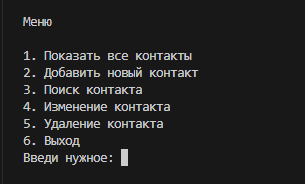

# Телефонный справочник (Python)

## Информация о проекте

Данное приложение - это телефонный справочник с консольным вводом через терминал текстового редактора.<br>
Результат заполнения справочника сохраняется в файл .txt.

Меню справочника выглядит так:


## Иструкции по установке и запуску приложения

Необходимо установить интерпретатор python
([Ссылка на официальный сайт](https://www.python.org/ "переход на оф.сайт python")) и расширение для python в VS Code ([Ссылка для скачивания расширения](https://marketplace.visualstudio.com/items?itemName=ms-python.python "переход на оф.сайт visual studio")).

Далее:

1. Склонировать репозиторий
```
git clone 
```
2. Перейти в директорию проекта
```
cd 
```
3. Запустить скрипт и действовать в соответствии с инструкциями в меню
```
phoneBook.py
```
